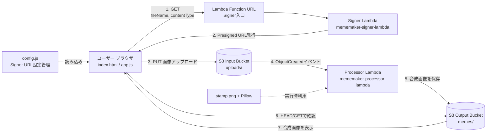
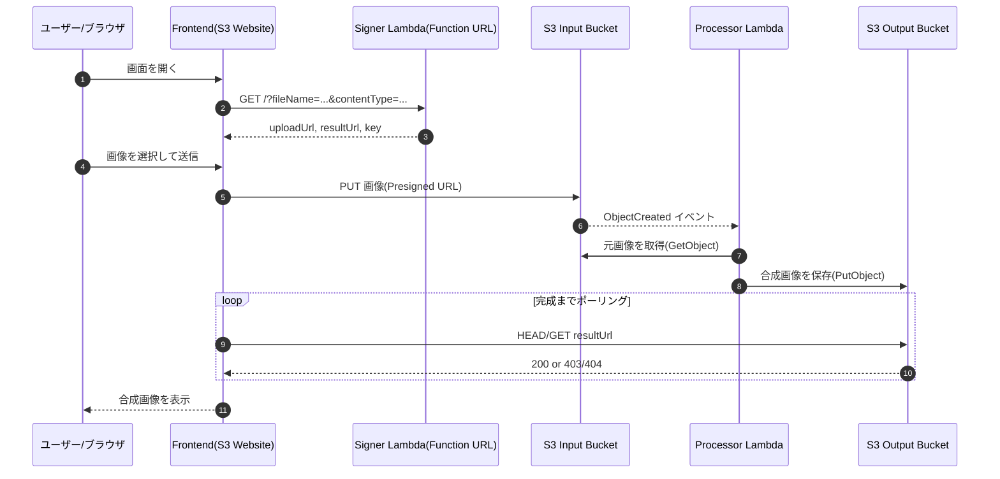

# システム全体図（アーキテクチャ）

## 1. 全体構成

## 1.1 シーケンス図（sequenceDiagram）

## 2. コンポーネント責務

- ブラウザ
  - Signerへ問い合わせ
  - Presigned URLでInputへ直接PUT
  - Outputをポーリングして結果表示
- Signer Lambda
  - `uploadUrl` / `resultUrl` / `key` を返却
- Input Bucket
  - 元画像の一時保管（`uploads/`）
- Processor Lambda
  - 画像を読み込み、`stamp.png` を重ねる
  - `memes/` に出力
- Output Bucket
  - 合成後画像の公開配信

## 3. シーケンス（時系列）

1. ブラウザが Function URL に `GET`。
2. Signer Lambda が Presigned URL を返す。
3. ブラウザが Input Bucket へ `PUT`。
4. S3イベントで Processor Lambda 起動。
5. Processor が Output Bucket に保存。
6. ブラウザが Output 側を `HEAD/GET` で確認。
7. 生成完了後、画像を表示。

## 4. 主要設定ポイント

- CORS は Function URL と S3（Input/Output）で整合を取る。
- Event Notification の Prefix は `uploads/`。
- Suffix で拡張子を絞る場合は `.png`/`.jpg`/`.jpeg` の取り扱いに注意。
- Processor Lambda の Runtime と Pillow バイナリ互換を一致させる。
